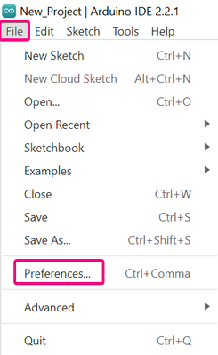
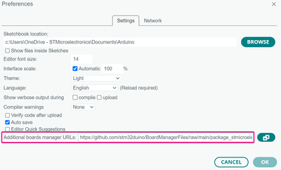
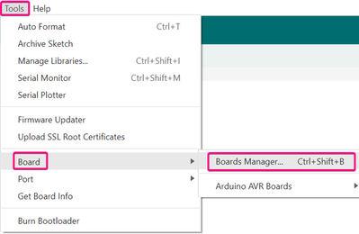
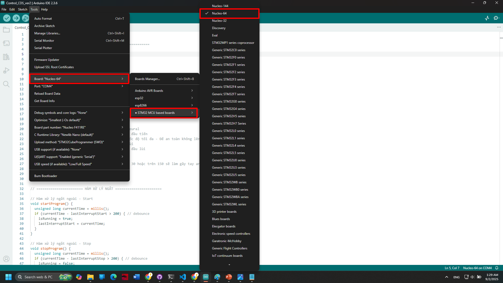
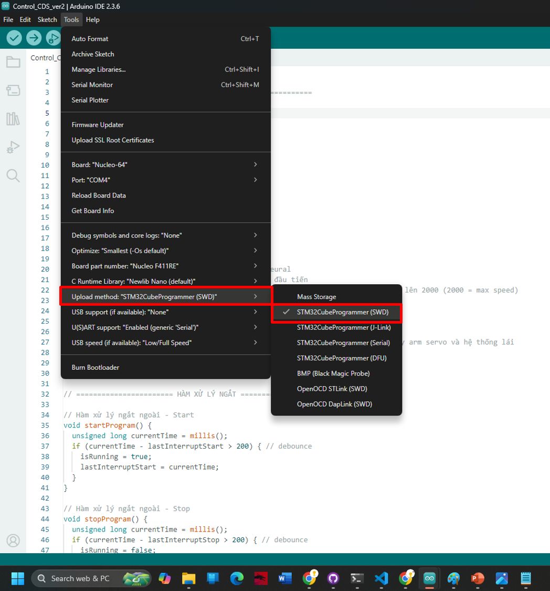
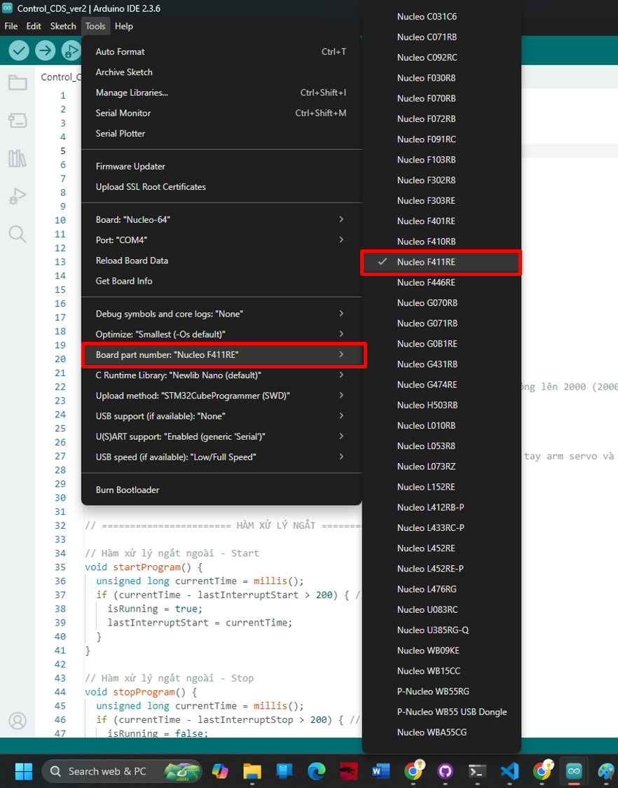
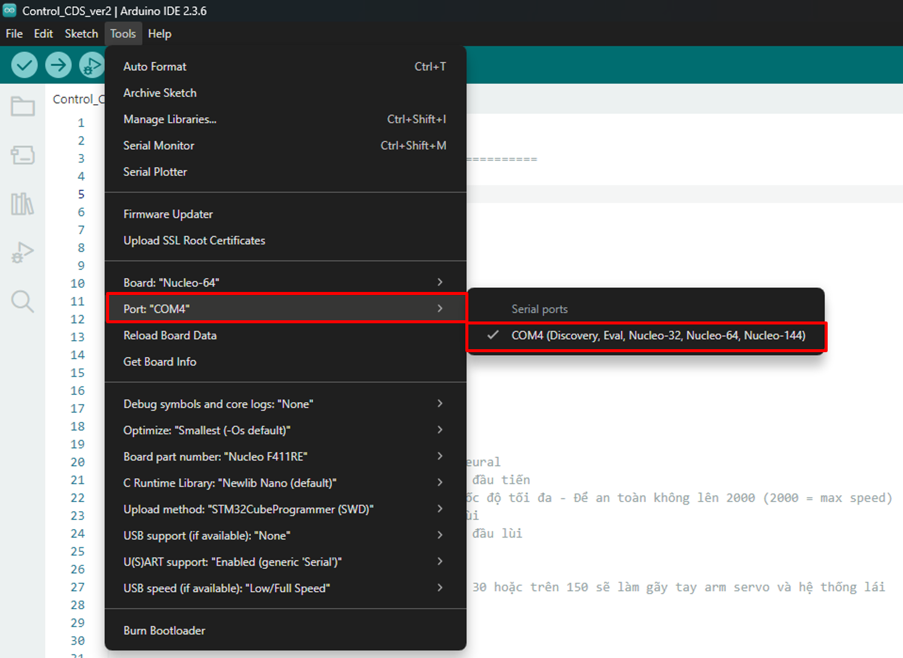
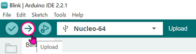
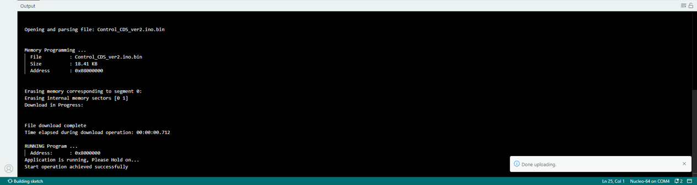

# Hướng dẫn cài đặt hỗ trợ STM32 cho Arduino IDE

Để sử dụng bo mạch STM32 với Arduino IDE, bạn cần cài đặt gói hỗ trợ STM32. Vui lòng làm theo các bước dưới đây:

## Bước 1: Mở "Preferences"

* Mở **Arduino IDE**.
* Chọn menu **File** > **Preferences**.



Trong cửa sổ "Preferences", thêm đường dẫn sau vào trường **"Additional Boards Managers URLs"**, sau đó nhấn **OK**:

```
https://github.com/stm32duino/BoardManagerFiles/raw/main/package_stmicroelectronics_index.json
```




## Bước 2: Mở "Boards Manager"

* Truy cập **Tools** > **Board** > **Boards Manager**.



## Bước 3: Tìm và cài đặt STM32

* Trong cửa sổ "Boards Manager", chọn loại **"Contributed"**.
* Tìm kiếm với từ khóa: **"STM32 MCU based boards"**.
* Nhấn **Install** để cài đặt gói hỗ trợ.


---

## 3.2 Chọn vi điều khiển STM32

Sau khi quá trình cài đặt hoàn tất, đóng cửa sổ "Boards Manager" và vào **Tools > Board > STM32 MCU based boards**.

Tại đây, bạn sẽ thấy danh sách các dòng vi điều khiển STM32 như: **Nucleo**, **Discovery**, **Evaluation boards**, hoặc các **Generic STM32 MCUs**.  
Hãy chọn loại board **Nucleo-64**.



---

## 3.3 Tải chương trình (Uploading the code)

Để bắt đầu lập trình **STM32F411RE Nucleo**, bạn cần chọn phương thức upload là **Serial Wire Debug (SWD)**.



Bạn nên cài đặt **STM32CubeProgrammer** để hỗ trợ lập trình dễ dàng hơn thông qua các phương pháp kể trên.  
STM32CubeProgrammer hỗ trợ nạp chương trình bằng phương pháp kéo-thả (drag-and-drop) mà không cần sử dụng probe ngoài.  
Tuy nhiên, đây là bước **tùy chọn** — bạn vẫn có thể lập trình trực tiếp thông qua Arduino IDE.

### 🔹 Chọn "Board Part Number"

Vào **Tools > Board Part Number >** và chọn đúng **part number** của bo mạch STM32 mà bạn đang sử dụng.



### 🔹 Chọn cổng COM

Kết nối board với máy tính qua cổng USB, sau đó vào **Tools > Port >** và chọn đúng **Port Number**:



### 🔹 Tải chương trình

Nhấn nút **Upload**, chờ chương trình được biên dịch và nạp vào board.



✅ Khi thấy thông báo như hình dưới đây, việc lập trình đã thành công!



---


📘 **Ghi chú:**  
Để tìm hiểu thêm về chức năng **debug** trong Arduino IDE, bạn có thể tham khảo tài liệu chính thức tại:  
🔗 [https://www.arduino.cc/](https://www.arduino.cc/)

---

## 🔗 Tham khảo tại:

🔗 [ST Community - How to program and debug the STM32 using the Arduino IDE](https://community.st.com/t5/stm32-mcus/how-to-program-and-debug-the-stm32-using-the-arduino-ide/ta-p/608514)

---

🎉 **Cảm ơn bạn đã theo dõi hướng dẫn!**  
Hy vọng bạn đã học được cách cấu hình và lập trình STM32 qua Arduino IDE một cách dễ dàng!

---
